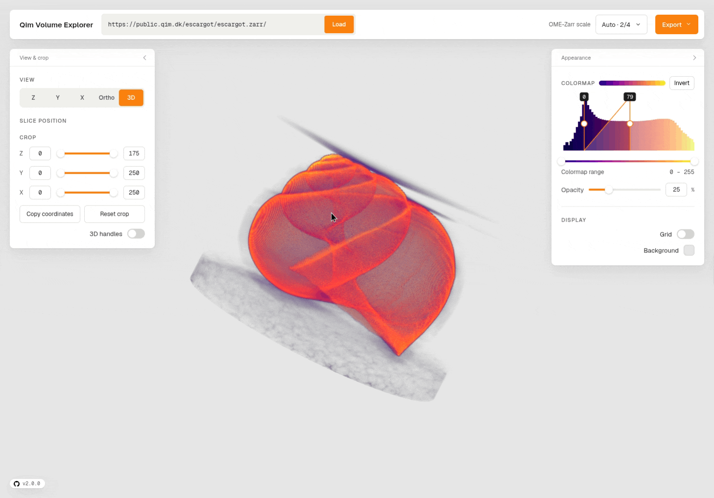

# QIM Volume Explorer

The QIM Volume Explorer is a browser-based data exploration tool for 3D image analysis, developed by the [QIM Center](https://qim.dk/).

It is implemented on top of the [vole-core library](https://github.com/allen-cell-animated/vole-core), made by the [Allen Institute for Cell Science](https://www.allencell.org/).



## Features

- **Volumetric 3D rendering** — interactive volume rendering with adjustable opacity.
- **2D slice and ortho views** — jump between X, Y, and Z slice views, three-way orthogonal views, and the 3D volume with a single control, and step through slices with a slider.
- **Multiple data formats** — load OME-Zarr, OME-NGff (`.h5`/`.hdf5`), and OME-Tiff data directly from a URL, or open local `.tif`/`.tiff`.
- **Colormaps & histogram** — pick from a set of scientific colormaps (viridis, plasma, inferno, magma, cividis, grayscale), invert them, and drive the intensity window by brushing directly on the intensity histogram.
- **Area of interest cropping** — crop X/Y/Z with dual sliders or numeric indices, and toggle draggable 3D crop handles right in the viewport. Copy the crop coordinates for reuse elsewhere.
- **OME-Zarr scale level selection** — automatically pick the most detailed level that fits in memory, or override it per dataset from the top bar.
- **Pixel readout** — hover over a 2D slice view to see the voxel coordinates and intensity value under the cursor.


## Installation

Install globally to get the `volume-explorer` command on your `PATH`:

```sh
npm install -g @qim3d/volume-explorer
volume-explorer
```

You can also run it without a global install:

```sh
npx @qim3d/volume-explorer
```

To open a dataset directly:

```sh
volume-explorer https://public.qim.dk/escargot/escargot.zarr/
```

## Usage

The explorer opens with a OME-Zarr public dataset by default. Paste any dataset URL into the top bar and press **Load** to switch.

### Supported data types

- `.zarr` / `.ome.zarr` — OME-Zarr (multi-scale, multi-channel, multi-time)
- `.h5` / `.hdf5` — OME-NGff
- `.ome.tif` / `.ome.tiff` — OME-Tiff
- `.tif` / `.tiff` — plain tiff stacks (local files)

### URL parameters

The app URL accepts a few query parameters, which are preserved when sharing a view link:

| Parameter | Description |
| --- | --- |
| `src` | Dataset URL to load on start. |
| `colormap` | Initial colormap name (e.g. `viridis`, `plasma`, `inferno`, `magma`, `cividis`, `grayscale`). |
| `hidden` | `true` hides the UI panels, for embedded use. |
| `turntable` | `true` enables auto-rotation of the camera (pauses while hovering). |
| `maxActiveRequests` | Number of concurrent data fetches (useful on large datasets). |

Example:

```
https://viz.qim.dk/?src=https%3A%2F%2Fpublic.qim.dk%2Fescargot%2Fescargot.zarr%2F
```

### Advanced

There is a hidden menu for advanced users, accessible by pressing `Ctrl + Alt + 1` and `Ctrl + Alt + 2`. It exposes low-level rendering controls such as ray step size, camera focus/aperture, mask alpha, and per-channel isosurface values.

## Development

```sh
git clone git@github.com:qim-center/volume-explorer.git
cd volume-explorer
npm install
npm run dev
```

For a production-style local run that uses the packaged CLI and built assets:

```sh
npm run build
npm start
```

- The library code lives in `src/` and compiles to `es/`; the web app lives in `public/` and is built to `dist/app/`.
- `npm run checks` runs lint, typecheck, and tests.
